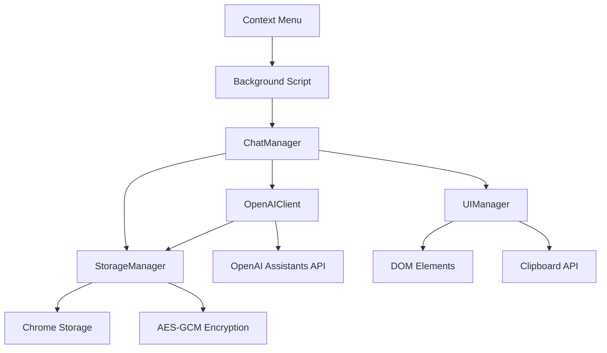

# Misinformation Manager - Architecture Documentation

## Overview

The Misinformation Manager is a Chrome extension built with a modular architecture that analyzes web content for potential misinformation using OpenAI's Assistant API. The extension integrates seamlessly with web browsing through context menus and provides a chat-based interface for content analysis.

## Modular Architecture

The application is structured using a clean separation of concerns with four main modules:

### 1. ChatManager (Main Orchestrator)
**Location**: `chat.js`
**Purpose**: Central coordinator that manages the entire application lifecycle

**Responsibilities**:
- Application initialization and URL parameter handling
- Chat conversation management and persistence
- Context menu integration and text processing
- Event coordination between all modules
- User interaction orchestration

**Key Features**:
- URL-based action handling (newChat, selectChat, continueChat)
- Quote block management for highlighted web content
- Chat lifecycle management (create, load, delete, rename)
- Auto-title generation from content analysis
- Search functionality across chat history

### 2. StorageManager (Data Layer)
**Location**: `storage-manager.js`
**Purpose**: Handles all data persistence, encryption, and Chrome storage operations

**Security Features**:
- AES-GCM 256-bit encryption for sensitive chat data
- Automatic encryption key generation and secure storage
- API key encryption and management
- Debounced saves to prevent excessive storage operations

**Storage Strategy**:
- Encrypted chat messages and content
- Unencrypted chat titles for fast context menu access
- Separate API key storage with encryption
- Fallback mechanisms for corrupted or missing data

### 3. OpenAIClient (API Layer)
**Location**: `openai-client.js`
**Purpose**: Manages all communication with OpenAI's Assistants API

**API Integration**:
- OpenAI Assistants API v2 implementation
- Thread and run management for conversation context
- Exponential backoff polling (500ms to 8s intervals)
- Comprehensive error handling and timeout protection
- Connection testing for API key validation

**Flow**:
1. Create thread for conversation context
2. Add user message to thread
3. Create run with specific assistant ID
4. Poll for completion with exponential backoff
5. Retrieve and return assistant response

### 4. UIManager (Presentation Layer)
**Location**: `ui-manager.js`
**Purpose**: Controls all DOM manipulation, rendering, and user interface interactions

**UI Components**:
- Message rendering with quote block support
- Chat history sidebar with search and filtering
- Copy-to-clipboard functionality with fallback support
- Settings modal with API key management
- Quote block input handling for web content
- Responsive textarea and UI state management

**Performance Optimizations**:
- Cached DOM element access
- Debounced input handling
- Efficient message rendering
- Lazy loading of UI components

## Data Flow Architecture

### 1. Context Menu Integration
```
Web Page → User Selection → Context Menu → Background Script → 
Extension Window (with URL parameters) → ChatManager → UI Display
```

### 2. Message Processing
```
User Input → UIManager → ChatManager → StorageManager (encrypt & save) →
OpenAIClient → OpenAI API → Response Processing → UI Update
```

### 3. Storage Operations
```
Chat Data → StorageManager → AES-GCM Encryption → Chrome Storage API →
Debounced Writes → Persistence
```

## Component Interactions



## Security Architecture

### Data Protection
- **Client-side encryption**: All chat data encrypted with AES-GCM before storage
- **API key security**: OpenAI API keys encrypted and never stored in plain text
- **XSS prevention**: All user input sanitized before DOM insertion
- **Secure random**: Crypto-secure random number generation for encryption keys

### Privacy Features
- **Local storage**: All data remains on user's device
- **No tracking**: No user data sent to third-party services except OpenAI API
- **Isolated contexts**: Chrome extension security model prevents page access

## Performance Optimizations

### Storage Efficiency
- **Debounced saves**: Prevents excessive storage operations (1s delay)
- **Incremental updates**: Only modified data is re-encrypted and saved
- **Separate metadata**: Chat titles stored separately for fast access

### API Efficiency  
- **Exponential backoff**: Intelligent polling prevents API rate limiting
- **Connection pooling**: Reuses HTTP connections for better performance
- **Timeout management**: Prevents hanging requests with configurable timeouts

### UI Performance
- **DOM caching**: Frequently accessed elements cached in memory
- **Event delegation**: Efficient event handling for dynamic content
- **Lazy rendering**: Messages rendered only when needed

## Extension Integration

### Manifest V3 Compatibility
- **Service worker**: Background script runs as service worker
- **Declarative permissions**: Minimal required permissions
- **Content Security Policy**: Strict CSP for security

### Chrome APIs Used
- **Storage API**: Local data persistence
- **Context Menus API**: Web page integration
- **Windows API**: Extension window management
- **Web Crypto API**: Client-side encryption

## Error Handling Strategy

### Graceful Degradation
- **Storage failures**: Falls back to in-memory operation
- **API failures**: Clear error messages with retry options
- **Encryption failures**: Fallback to unencrypted storage with user warning
- **Network issues**: Offline mode with queue for pending operations

### User Feedback
- **Loading states**: Visual feedback during API operations
- **Error messages**: Clear, actionable error descriptions
- **Status indicators**: Real-time connection and operation status
- **Recovery options**: User-initiated retry and reset functions

## Development Patterns

### Module Pattern
- Each module is a self-contained class with clear responsibilities
- Dependencies injected through constructor parameters
- No global state or variable pollution

### Event-Driven Architecture
- Loose coupling between components through event delegation
- Centralized event handling in ChatManager
- Clear separation between data and presentation layers

### Async/Await Pattern
- Consistent async operation handling
- Proper error propagation through promise chains
- No callback hell or promise nesting

This architecture ensures maintainability, security, and performance while providing a seamless user experience for misinformation analysis and content verification.